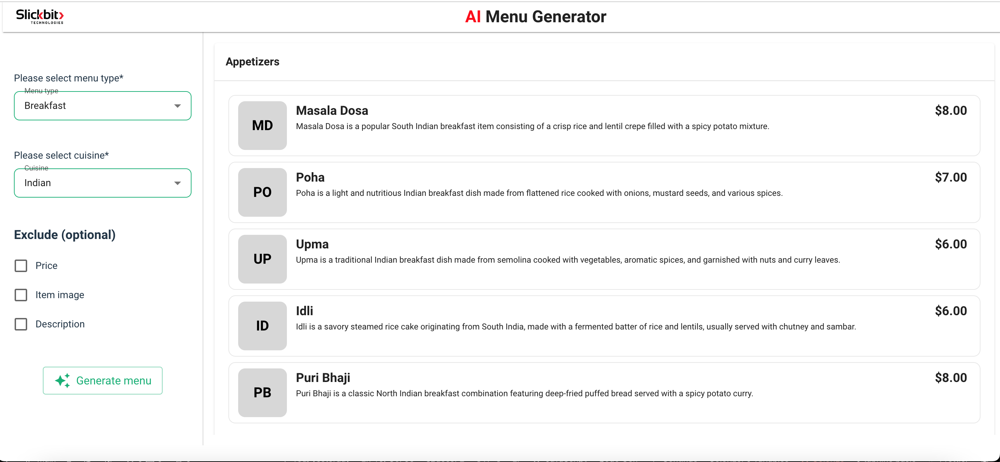

# AI-Menu Generator

> Generate restaurant menu based on meal time and cuisine.

You can view a live demo here: [Live Demo URL](https://flow.slickbit.com/)

---

## 📦 Installation

Follow these steps to set up the project locally.

### Prerequisites

- [Node.js](https://nodejs.org/) (version 16 or above)
- [React.js](https://react.dev/) (version 18 or above)

### Steps

1. **Clone the repository**
   git clone https://github.com/SlickbitTechnologies/ai-menu-generator.git

2. **Navigate into the project directory**
    cd ai-menu-generator

3. **Install dependencies**
    npm install

4. **Start the development server**
    npm run dev

**The app should now be running on** http://localhost:8089